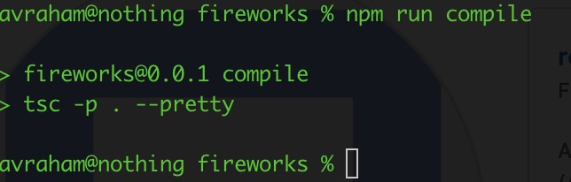
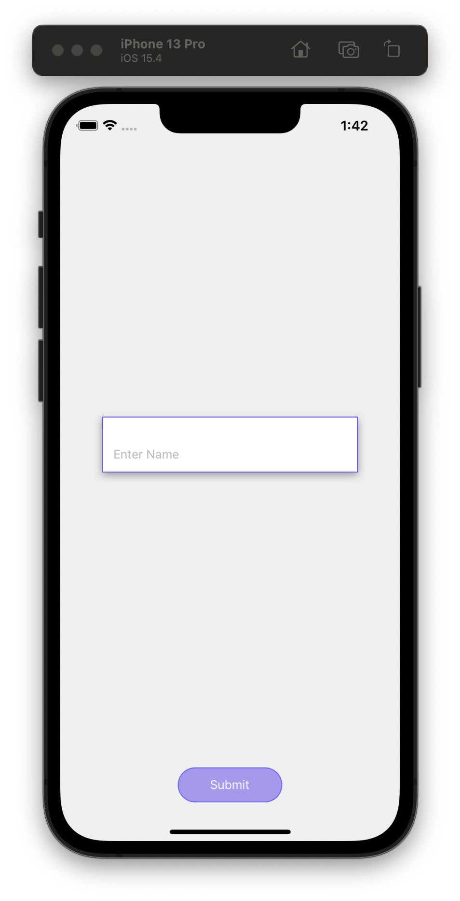
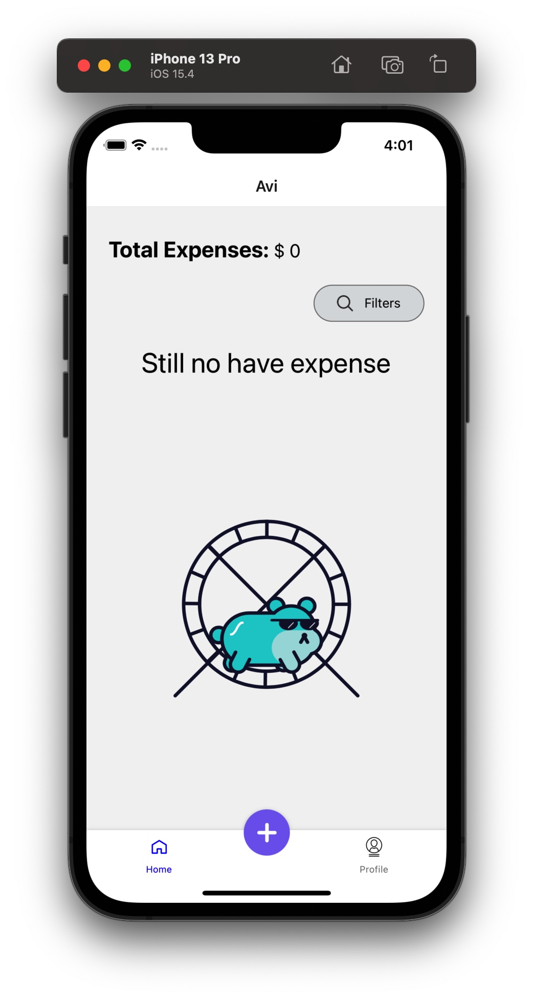
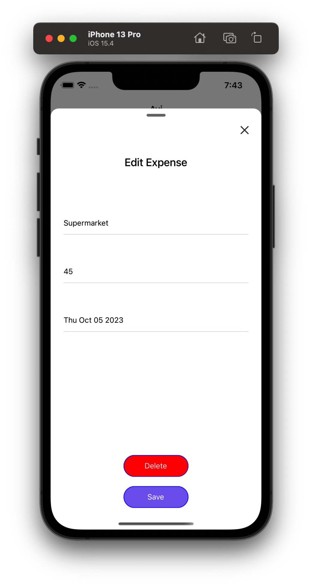
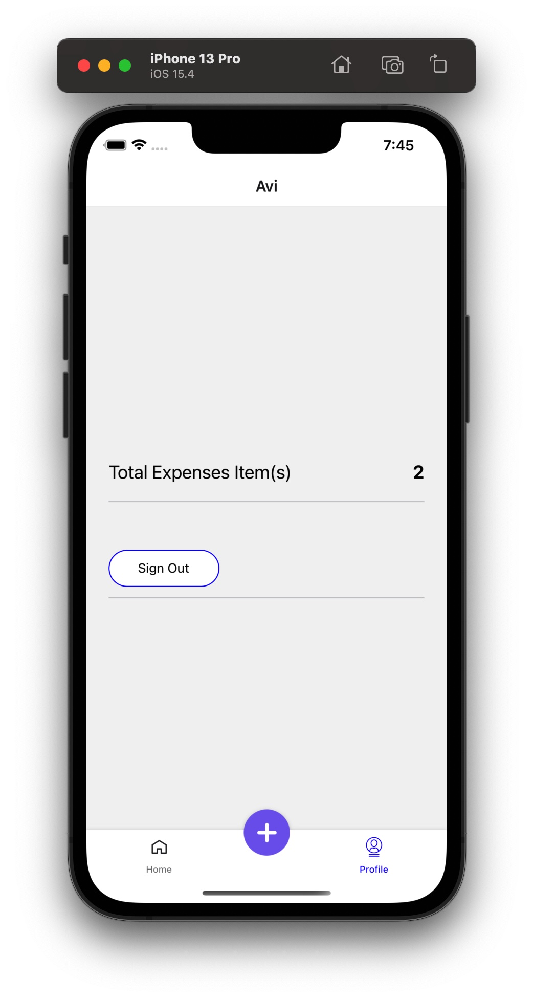
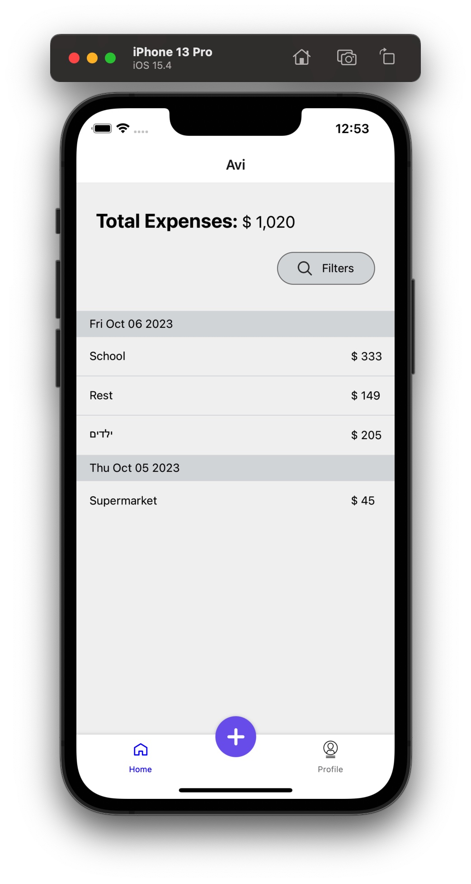

## Fireworks - Expenses Tracking app
> A simple React-Native application to track expenses

## Features

1. Local storage
2. zustand state management
3. svg format support
4. last version of RN (very fast with hermes!)
5. cool bottom nav bar design 
6. react navigation stack
7. fully typescript (0 compilation error using strict mode and strong types)
   
   

8. filtering
9. date picker

## Left over

1. Input field validation with regexp
2. Unit test

## Reasons Behind Technical Choices
1. You might find some unusual elements in my code, and I would be happy to explain my decisions. In general, I aimed to maintain clean code. However, due to the limited time available (I only worked on it during the evenings), I took some shortcuts that I wouldn't have taken in a production application.

## Installation

1. make sure you run with node 18 and above
2. git clone git@github.com:ah584d/fireworks.git
3. cd fireworks
4. npm ci -d
5. cd ios
6. pod install
7. run Xcode and open ios folder, then press play button, it will take a few minutes and will launch the application

## Usage

1. Tested on iPhone simulator ** only ** [ I don't have iphone device ]
2. The application usage is self explained, the only "hidden" feature is that you need to long press on an expense in order to edit/delete it

## Screenshots

  
